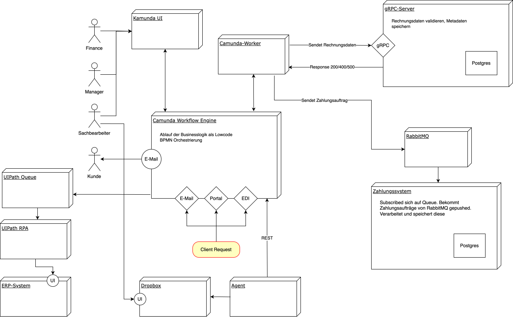

# Rechnungsbearbeitung

> Verteiltes System zur automatisierten Rechnungsbearbeitung, Zahlungsverarbeitung und Workflow-Orchestrierung mit Java 25, gRPC, RabbitMQ, PostgreSQL und Camunda 8.

## Inhaltsverzeichnis

- [Projektübersicht](#projektübersicht)
- [Systemarchitektur](#systemarchitektur)
- [Tech-Stack](#tech-stack)
- [Voraussetzungen](#voraussetzungen)
- [Schnellstart](#schnellstart)
- [Module](#module)
- [Konfiguration](#konfiguration)
- [Entwicklung](#entwicklung)
- [Debugging](#debugging)
- [Lizenz](#lizenz)
- [AI Hinweis](#ai-hinweis)

## Projektübersicht

Das System besteht aus vier Microservices und einer externen Workflow-Engine:

| Modul | Beschreibung |
|-------|-------------|
| **grpc** | Validiert und speichert Rechnungsmetadaten (PostgreSQL + Flyway) |
| **zahlungssystem** | Asynchrone Zahlungsverarbeitung über RabbitMQ |
| **client** | XML-basierter Rechnungsimport mit gRPC-Integration |
| **camunda-workers** | Job-Worker für Camunda 8 SaaS – speichert Metadaten & erstellt Zahlungsaufträge |

Zusätzlich:
- **Camunda 8 (SaaS)** – BPMN-basierte Orchestrierung inkl. User Tasks, E-Mail- und EDI-Integration
- **ERP-System** – Externes System zum Eintragen der Rechnungsdaten

## Systemarchitektur
### Workflow-Engine



### Client
```
                       ┌─── gRPC ───► gRPC-Server ───► PostgreSQL (Port 5432)
                       │
Client ────────────────┤
                       │
                       └─── AMQP ───► RabbitMQ (Port 5672)
                                            │
                                            ▼
                                     ZahlungsConsumer ───► PostgreSQL (Port 5433)

───────────────────────────────────────────────────────────────────────────────────

Camunda 8 Cloud ◄────► Camunda Workers ────► gRPC-Server / RabbitMQ
```

## Tech-Stack

| Technologie | Version | Zweck |
|-------------|---------|-------|
| Java | 25 | Laufzeit |
| Maven | 3.8+ | Build-System |
| gRPC | 1.75.0 | Service-Kommunikation |
| Protocol Buffers | 4.30.2 | Serialisierung |
| RabbitMQ | 3.x | Message Broker |
| PostgreSQL | latest | Datenbanken |
| Flyway | 11.8.0 | DB-Migrationen |
| HikariCP | 5.1.0 / 7.0.2 | Connection Pooling |
| Camunda 8 SDK | 8.8.24 | Workflow-Engine Client |
| Jackson | 2.17.0 | JSON-Serialisierung |
| Hibernate Validator | 8.0.1 | Bean Validation |
| Spotless + Google Java Format | 1.27.0 | Code-Formatierung |
| Jib | 3.4.0 | Container-Images |

## Voraussetzungen

- **Java 25+** (z. B. Eclipse Temurin)
- **Maven 3.8+**
- **Docker & Docker Compose**
- **Camunda 8 SaaS Account** (Cluster-ID, Client-ID & Secret erforderlich)

## Schnellstart

### 1. Repository klonen

```bash
git clone <repository-url>
cd rechnungsbearbeitung
```

### 2. Umgebungsvariablen konfigurieren

```bash
cp example.env .env
```

Passe in der `.env` die Camunda-Cloud-Zugangsdaten an:

```env
CAMUNDA_CLIENT_CLOUD_CLUSTER_ID=<deine-cluster-id>
CAMUNDA_CLIENT_AUTH_CLIENT_ID=<deine-client-id>
CAMUNDA_CLIENT_AUTH_CLIENT_SECRET=<dein-secret>
```

### 3. Projekt bauen & Container-Images erstellen

```bash
mvn clean install
mvn -pl grpc,zahlungssystem,camunda-workers jib:dockerBuild
```

### 4. Alle Services starten

```bash
docker compose up
```

Startet alles in einem Schritt mit Live-Log-Ausgabe:
- PostgreSQL für gRPC (Port 5432)
- PostgreSQL für Zahlungssystem (Port 5433)
- RabbitMQ (AMQP: 5672, Management-UI: 15672)
- gRPC-Server (Port 50051)
- Zahlungssystem-Consumer
- Camunda Workers

Im Hintergrund starten (ohne Logs):

```bash
docker compose up -d
```

Status prüfen:

```bash
docker compose ps
```


## Module

### gRPC-Server (`grpc/`)

- **Port:** 50051
- **Proto-Definition:** [`rechnungs_metadata.proto`](grpc/src/main/proto/rechnungs_metadata.proto)
- **RPC:** `SpeicherMetadaten` – validiert und persistiert Rechnungsmetadaten
- **DB-Migrationen:** Flyway unter `grpc/src/main/resources/db/migration/`
- **Container-Build:** `mvn -pl grpc jib:dockerBuild`

### Zahlungssystem (`zahlungssystem/`)

- **Queue:** `zahlungsauftraege`
- **Consumer:** Verarbeitet Zahlungsaufträge asynchron
- **Producer:** Stellt Zahlungsaufträge in die Queue
- **DB-Migrationen:** Flyway unter `zahlungssystem/src/main/resources/db/migration/`

### Client (`client/`)

- Liest Rechnungen aus [`rechnungen.xml`](client/src/main/resources/rechnungen.xml)
- Sendet diese per gRPC an den Server
- Erstellt Zahlungsaufträge via `ZahlungsProducer`

### Camunda Workers (`camunda-workers/`)

- Verbindet sich mit Camunda 8 SaaS
- **MetadatenSpeichernHandler:** Speichert Rechnungsdaten per gRPC
- **ZahlungsserviceHandler:** Erstellt Zahlungsaufträge auf RabbitMQ
- Resilient: liefert Ergebnis auch bei temporärer Service-Nichtverfügbarkeit zurück

## Konfiguration

Alle Konfiguration erfolgt über Umgebungsvariablen (`.env`-Datei):

| Variable | Beschreibung | Standard |
|----------|-------------|----------|
| `GRPC_DB_PORT` | PostgreSQL-Port (gRPC) | `5432` |
| `GRPC_DB_URL` | JDBC-URL (gRPC) | `jdbc:postgresql://localhost:5432/grpc` |
| `GRPC_DB_USERNAME` | DB-User | `kunde` |
| `GRPC_DB_PASSWORD` | DB-Passwort | `p` |
| `GRPC_DB_CLEAN` | Flyway clean bei Start | `true` |
| `GRPC_HOST` | gRPC-Server Host | `localhost` |
| `GRPC_PORT` | gRPC-Server Port | `50051` |
| `RABBITMQ_HOST` | RabbitMQ Host | `localhost` |
| `RABBITMQ_PORT` | RabbitMQ Port | `5672` |
| `RABBITMQ_USERNAME` | RabbitMQ User | `kunde` |
| `RABBITMQ_PASSWORD` | RabbitMQ Passwort | `p` |
| `RABBITMQ_QUEUE_NAME` | Queue-Name | `zahlungsauftraege` |
| `ZAHLUNGSSYSTEM_DB_PORT` | PostgreSQL-Port (Zahlung) | `5433` |
| `ZAHLUNGSSYSTEM_DB_URL` | JDBC-URL (Zahlung) | `jdbc:postgresql://localhost:5433/zahlungssystem` |
| `ZAHLUNGSSYSTEM_DB_CLEAN` | Flyway clean bei Start | `true` |
| `CAMUNDA_CLIENT_MODE` | Camunda-Modus | `saas` |
| `CAMUNDA_CLIENT_CLOUD_CLUSTER_ID` | Cluster-ID | – |
| `CAMUNDA_CLIENT_CLOUD_REGION` | Region | `bru-2` |
| `CAMUNDA_CLIENT_AUTH_CLIENT_ID` | OAuth Client-ID | – |
| `CAMUNDA_CLIENT_AUTH_CLIENT_SECRET` | OAuth Secret | – |

## Entwicklung

### Code formatieren

```bash
mvn spotless:apply
```

### Code-Stil prüfen

```bash
mvn spotless:check
```

### Einzelnes Modul bauen

```bash
mvn -pl grpc clean install
mvn -pl zahlungssystem clean install
mvn -pl client clean install
mvn -pl camunda-workers clean install
```

### Container-Images bauen

```bash
mvn -pl grpc,zahlungssystem,camunda-workers jib:dockerBuild
```

Erzeugt Images basierend auf `eclipse-temurin:25-jre-alpine`.

## Debugging

### Erwartete Startmeldungen

| Service | Meldung |
|---------|---------|
| gRPC-Server | `gRPC-Server gestartet auf Port 50051` |
| ZahlungsConsumer | `ZahlungsConsumer bereit. Warte auf Nachrichten in 'zahlungsauftraege'...` |

### Datenbank inspizieren

```bash
# Rechnungsmetadaten
psql -h localhost -p 5432 -U kunde -d grpc -c "SELECT * FROM rechnungsmetadaten;"

# Zahlungsaufträge
psql -h localhost -p 5433 -U kunde -d zahlungssystem -c "SELECT * FROM zahlungsauftraege;"
```

### RabbitMQ Management-UI

```
http://localhost:15672
Benutzer: kunde | Passwort: p
```

### Häufige Fehler

| Fehler | Ursache | Lösung |
|--------|---------|--------|
| `Connection refused :5432/:5433` | Docker-Services nicht gestartet | `docker compose up -d` |
| `Connection refused :5672` | RabbitMQ nicht gestartet | Siehe oben |
| `ClassNotFoundException` | Projekt nicht gebaut | `mvn clean install` |
| Camunda-Verbindungsfehler | Falsche Credentials | `.env` prüfen (Cluster-ID, Client-ID, Secret) |

## Aufräumen

```bash
# Services stoppen
docker compose down

# Inkl. Volumes (Datenbanken löschen)
docker compose down -v
```

## Projektstruktur

```
rechnungsbearbeitung/
├── docker-compose.yml                 # Root Compose (verweist auf backend)
├── pom.xml                            # Parent POM (Java 25, Spotless)
├── example.env                        # Umgebungsvariablen-Template
├── DVG-Orchestrierung.drawio.svg      # Architekturdiagramm
│
├── grpc/                              # gRPC-Server
│   ├── pom.xml
│   └── src/main/
│       ├── java/com/example/grpc/
│       │   ├── GrpcServer.java
│       │   ├── config/
│       │   ├── entity/
│       │   ├── repository/
│       │   └── service/
│       ├── proto/rechnungs_metadata.proto
│       └── resources/db/migration/
│
├── zahlungssystem/                    # Zahlungsverarbeitung
│   ├── pom.xml
│   └── src/main/java/com/example/zahlungssystem/
│       ├── ZahlungsConsumer.java
│       ├── ZahlungsProducer.java
│       ├── config/
│       ├── entity/
│       └── repository/
│
├── client/                            # Rechnungsimport-Client
│   ├── pom.xml
│   └── src/main/
│       ├── java/com/example/client/
│       │   ├── ClientApplication.java
│       │   ├── RechnungClient.java
│       │   ├── GrpcMapper.java
│       │   ├── Rechnung.java
│       │   └── Rechnungen.java
│       └── resources/rechnungen.xml
│
├── camunda-workers/                   # Camunda 8 Job-Worker
│   ├── pom.xml
│   └── src/main/java/com/example/camundaworkers/
│       ├── WorkerOrchestrator.java
│       ├── AppConfig.java
│       ├── GrpcClient.java
│       ├── MetadatenSpeichernHandler.java
│       └── ZahlungsserviceHandler.java
│
└── extras/compose/                    # Docker Compose
    ├── backend/docker-compose.yml     # Alles zusammen
    ├── grpc/docker-compose.yml        # PostgreSQL (gRPC)
    └── zahlungssystem/docker-compose.yml  # PostgreSQL + RabbitMQ
```

## Lizenz

Siehe [LICENSE](LICENSE).

---

## AI Hinweis
*Mit Hilfe von Copilot generiert.*

**Letzte Aktualisierung**: Mai 2026

